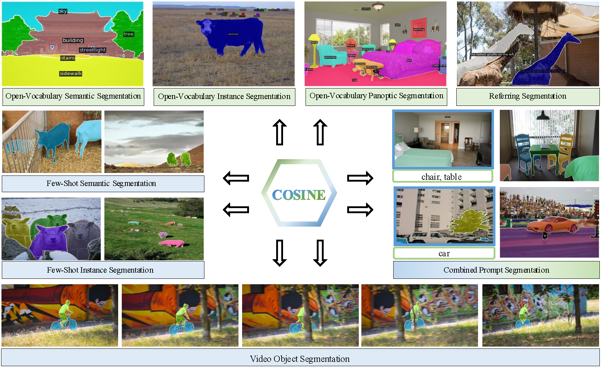

<h1>Unified Open-World Segmentation with Multi-Modal Prompts </h1>

[Yang Liu](https://scholar.google.com/citations?user=9JcQ2hwAAAAJ&hl=en)1*, &nbsp; 
Yufei Yin2*, &nbsp; 
Chenchen Jing3, &nbsp; 
Muzhi Zhu1, &nbsp;
[Hao Chen](https://stan-haochen.github.io/)1, &nbsp;
Yuling Xi1, &nbsp;
Bo Feng4, &nbsp;
Hao Wang4, &nbsp;
Shiyu Li4, &nbsp;
[Chunhua Shen](https://cshen.github.io/)1

1[Zhejiang University](https://www.zju.edu.cn/english/), &nbsp;
2Hangzhou Dianzi University, &nbsp;
3Zhejiang University of Technology, &nbsp;
4Apple

## 🚀 Overview

## 📖 Description

In this work, we present COSINE, a unified open-world segmentation model that consolidates open-vocabulary segmentation and in-context segmentation with multi-modal prompts (e.g. text and image). 
COSINE exploits foundation models to extract representations for an input image and corresponding multi-modal prompts, and a SegDecoder to align these representations, model their interaction, and obtain masks specified by input prompts across different granularities.
In this way, COSINE overcomes architectural discrepancies, divergent learning objectives, and distinct representation learning strategies of previous pipelines for open-vocabulary segmentation and in-context segmentation.
Comprehensive experiments demonstrate that COSINE has significant performance improvements in both open-vocabulary and in-context segmentation tasks. 
Our exploratory analyses highlight that the synergistic collaboration between using visual and textual prompts leads to significantly improved generalization over single-modality approaches. 

## 🎫 License

For academic use, this project is licensed under [the 2-clause BSD License](https://opensource.org/license/bsd-2-clause). 
For commercial use, please contact [Chunhua Shen](mailto:chhshen@gmail.com).